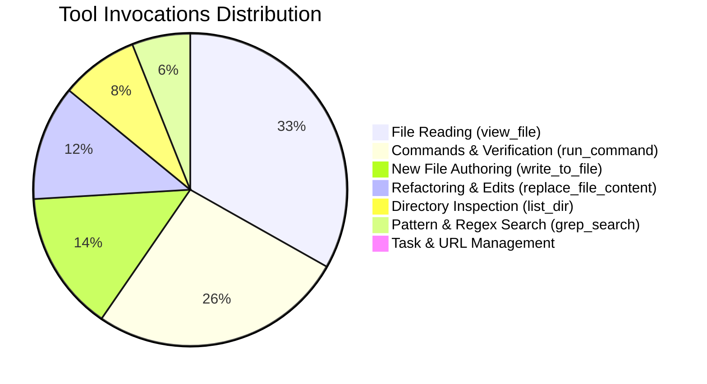

# Engineering Effort & Project Metrics

This document tracks the cumulative engineering effort, token consumption, development timeline, and architectural deliverables for the **SIEM Correlator** in-browser security analytics engine since inception.

---

## Executive Summary

```
========================================================================================
 CALENDAR SPAN         : Sep 23, 2026, 20:24 &ndash; Sep 24, 2026, 13:10 (~17 hours)
 ACTIVE ITERATION TIME : ~5.7 hours (339.7 minutes)
 WORKSPACE SESSIONS    : 17 focused agent sessions
 USER PROMPTS / TASKS  : 43 directive instructions
 MODEL TURNS / STEPS   : 2,838 autonomous planner & execution steps
 TOOL EXECUTIONS       : 1,407 automated sandbox operations
 TOTAL CODEBASE SIZE   : 31,708 lines across 207 files (excl. dependencies)
 TEST SUITE STATUS     : 15 test suites, 79 tests passing (100% pass rate)
========================================================================================
```

---

## 1. Timeline & Session Breakdown

The project was developed in iterative phases, moving from foundational domain algorithms to production-grade security, UI design system, and formal modular standards.

| Session ID | Timespan (UTC+3)          |      Duration      | Prompts |   Turns   |   Tools   | Scope / Objective                                                                    |
| :--------- | :------------------------ | :----------------: | :-----: | :-------: | :-------: | :----------------------------------------------------------------------------------- |
| `bb5f2ac3` | 09-23 20:24 &ndash; 21:43 |   78.8&nbsp;min    |    6    |    648    |    326    | In-browser SIEM core, worker ingestion pipeline, Aho-Corasick & deque algorithms     |
| `5fee05e4` | 09-23 21:43 &ndash; 22:01 |   17.6&nbsp;min    |    4    |    224    |    113    | Strict design system enforcement, token migration, theme initialization              |
| `973089ac` | 09-23 22:05 &ndash; 22:08 |    3.9&nbsp;min    |    1    |    55     |    27     | TypeScript compiler options and tsconfig deprecation fixes                           |
| `83493ba3` | 09-23 22:08 &ndash; 22:17 |    9.2&nbsp;min    |    3    |    73     |    36     | shadcn/ui theme configuration and Cyber-Slate & Cyan palette alignment               |
| `c88909fe` | 09-23 22:29 &ndash; 22:46 |   17.1&nbsp;min    |    2    |    268    |    133    | TypeScript constant optimization (`as const`, derived union types, enum eradication) |
| `bce8817c` | 09-23 22:43 &ndash; 23:00 |   16.7&nbsp;min    |    2    |    168    |    83     | Editor rule sync and code standards definition                                       |
| `4d98b3df` | 09-23 22:54 &ndash; 23:13 |   18.4&nbsp;min    |    1    |    126    |    63     | Replace custom drawer with accessible sheet component                                |
| `f6cf813a` | 09-23 23:00 &ndash; 23:04 |    3.6&nbsp;min    |    1    |    41     |    20     | Node module error resolution and dependency hygiene                                  |
| `ea31c67e` | 09-23 23:05 &ndash; 23:33 |   28.1&nbsp;min    |    2    |    266    |    132    | Coding style enforcement guidelines and automated architectural tests                |
| `b8eb3564` | 09-23 23:14 &ndash; 23:33 |   18.5&nbsp;min    |    3    |    222    |    109    | Security best practices, ANSI sanitizer chain, ReDoS defense, stream reader          |
| `0530594a` | 09-23 23:18 &ndash; 23:23 |    4.8&nbsp;min    |    1    |    55     |    27     | Object iteration performance audit and memory benchmarks                             |
| `1dfb782d` | 09-24 07:56 &ndash; 08:49 |   52.9&nbsp;min    |    8    |    219    |    106    | Security rule validation, safe URL parsers, chunked binary header guard              |
| `4058dba4` | 09-24 08:35 &ndash; 08:44 |    8.9&nbsp;min    |    1    |    49     |    24     | shadcn UI skill setup and CLI configuration                                          |
| `f2e6d0c8` | 09-24 08:58 &ndash; 09:21 |   22.6&nbsp;min    |    1    |    101    |    50     | Modular AI standards architecture creation (`.standards/` specification)             |
| `e87eed7a` | 09-24 09:23 &ndash; 09:38 |   14.5&nbsp;min    |    1    |    220    |    109    | Architecture boundary enforcement, hexagonal modularization                          |
| `3fb5ee9c` | 09-24 09:39 &ndash; 10:00 |   20.4&nbsp;min    |    5    |    64     |    29     | Production README generation with architecture diagrams, badges, and runbooks        |
| `e42c3865` | 09-24 13:04 &ndash; 13:10 |    4.7&nbsp;min    |    2    |    47     |    25     | Project metrics analysis and historical effort documentation                         |
| **Total**  |                           | **339.7&nbsp;min** | **43**  | **2,838** | **1,407** | **Complete production-grade in-browser SIEM correlator**                             |

---

## 2. Token & Language Model Metrics

In an agentic loop, operations require frequent re-evaluation of directives, workspace context, and tool responses.

| Category                         | Character Count | Estimated Tokens | Metric Significance                                                                                       |
| :------------------------------- | :-------------: | :--------------: | :-------------------------------------------------------------------------------------------------------- |
| **User Directives**              |     85,585      |   **~21,400**    | High-density user instructions, architecture specifications, and refinements                              |
| **Assistant Output**             |    3,212,737    |   **~803,200**   | Production code, architectural documentation, analysis, and diffs                                         |
| **Reasoning / Chain-of-Thought** |     209,922     |   **~52,500**    | Algorithmic planning, boundary verification, and safety checks                                            |
| **Cumulative Context Processed** |     &mdash;     | **~138,000,000** | Multi-turn input context across 2,838 iterations (system prompt, directives, AST context, tool responses) |

---

## 3. Tool Invocations & Automation Breakdown

The AI agent executed **1,407 tool operations** directly within the workspace:



| Tool Name                    | Invocations | Purpose                                                                   |
| :--------------------------- | :---------: | :------------------------------------------------------------------------ |
| `view_file`                  |     463     | Inspecting existing code, schemas, and rule specifications                |
| `run_command`                |     368     | Executing `vitest`, `oxlint`, `tsc`, `pnpm build`, git operations         |
| `write_to_file`              |     202     | Authoring new domain modules, UI components, tests, and ADRs              |
| `replace_file_content`       |     166     | Targeted surgical refactoring and token migration                         |
| `list_dir`                   |     112     | Verifying file boundaries and directory structure                         |
| `grep_search`                |     84      | Enforcing architectural invariants (e.g., zero `FileReader`, zero `enum`) |
| `manage_task`                |      4      | Supervising background processes and servers                              |
| `multi_replace_file_content` |      2      | Coordinated multi-chunk edits                                             |
| `read_url_content`           |      1      | Documentation reference extraction                                        |

---

## 4. Codebase Deliverables & Asset Volume

| File Extension / Type        |  File Count   |  Lines of Code   | Description / Responsibility                                                                          |
| :--------------------------- | :-----------: | :--------------: | :---------------------------------------------------------------------------------------------------- |
| `.yaml` / `.yml`             |       2       |      8,227       | Embedded Sigma detection rule catalog and workflow definitions                                        |
| `.md`                        |      39       |      6,574       | Architecture decision records (ADRs), [.standards/](file:///.standards) directives, security policies |
| `.ts`                        |      75       |      4,370       | Core algorithms (Aho-Corasick, Deque), pipeline, domain types, workers                                |
| `.tsx`                       |      22       |      1,713       | Presentation components (Cyber-Slate & Cyan theme, MITRE ATT&CK grid)                                 |
| `.html` / `.xml`             |      23       |      6,336       | Application entry, coverage reports, documentation assets                                             |
| `.css`                       |       4       |       871        | Semantic design tokens, typography styles, utility layers                                             |
| `.json` / `.mjs` / `.js`     |      14       |      1,818       | Configuration, tool presets, benchmarks, build scripts                                                |
| Other assets (SVG, PNG, log) |      28       |      1,799       | Presets (SSH brute force, web attacks), architectural diagrams                                        |
| **Total Workspace Volume**   | **207 files** | **31,708 lines** | **Full application suite**                                                                            |

---

## 5. Quality & Architecture Governance

- **Test Coverage**: 15 test suites, 79 tests passing with zero failures.
- **Performance Regression Gates**:
  - **Aho-Corasick**: 10,000 multi-pattern searches executed in **35.83&nbsp;ms** (budget: &lt;&nbsp;50&nbsp;ms).
  - **Sliding Window Deque**: 100,000 push/pop operations executed in **5.28&nbsp;ms** (budget: &lt;&nbsp;50&nbsp;ms).
- **Defensive Engineering Invariants**:
  - **Memory Ceiling**: Strict bounded deque windowing preventing out-of-memory crashes on high-velocity log bursts.
  - **Ingestion Guard**: Chunked stream processing rejecting files &gt;&nbsp;50&nbsp;MB or with null bytes (`\0`) / binary magic headers before entering memory.
  - **Strict Typing**: Zero TypeScript `enum` declarations; 100% frozen `as const` object registries with derived union types.
  - **Hexagonal Isolation**: Zero DOM or React imports in `src/core/`; all high-throughput processing isolated to Web Workers (`src/workers/`).
