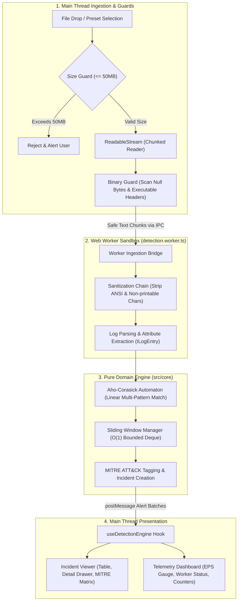
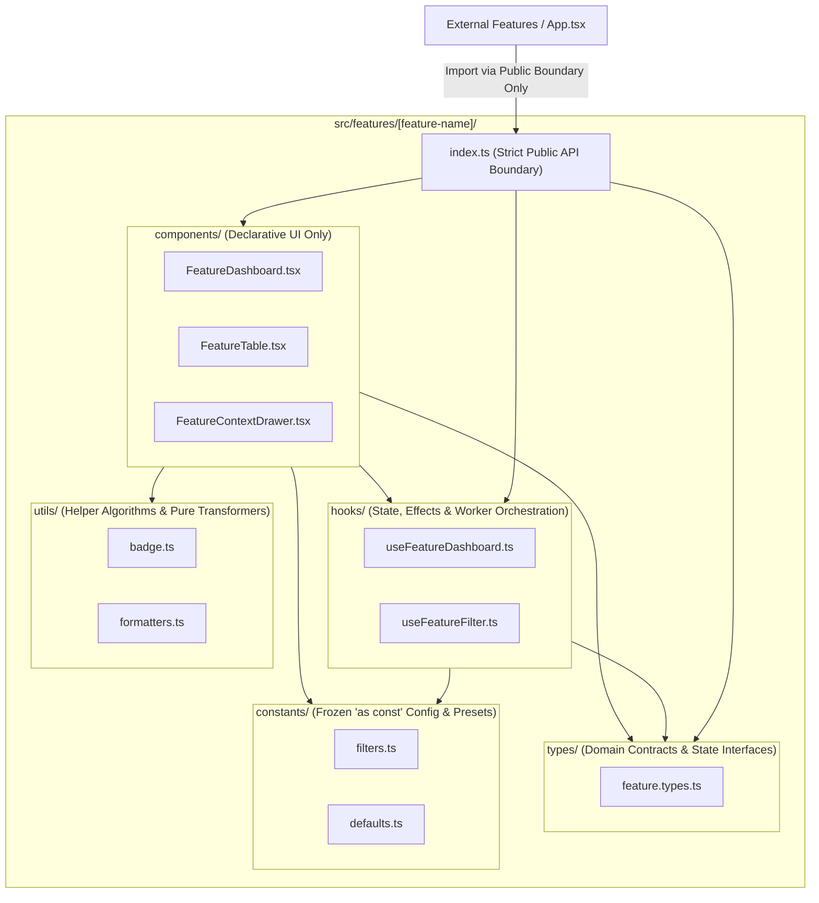

# Architecture & Core Data-Flow

A technical overview of the in-browser SIEM threat correlation engine, focusing on data isolation, deterministic processing guarantees, and modular feature encapsulation.

---

## 1. Secure Log Processing Pipeline (Data-Flow)

The log processing pipeline enforces strict defense-in-depth controls at every transition stage. Ingestion starts with pre-flight sanitization on the main thread, dispatches into an isolated Web Worker sandbox, and evaluates logs against deterministic detection algorithms before emitting structured alerts to the UI.

### Architectural Invariants

- **Pre-flight Size Guard:** Files exceeding 50&nbsp;MB (`MAX_LOG_FILE_SIZE_BYTES = 52428800`) are rejected immediately before reading.
- **Constant Memory Footprint:** The stream is consumed via `ReadableStream` and chunked with `TextDecoder("utf-8")`, avoiding browser memory exhaustion.
- **Worker Isolation:** Parsing and correlation execute in a dedicated Web Worker thread, keeping the UI responsive at 60&nbsp;FPS.
- **ANSI & Payload Sanitization:** ANSI escape sequences and non-printable control characters are stripped prior to pattern matching.
- **Deterministic ReDoS Immunity:** Token matching runs on a linear-time Aho-Corasick automaton ($O(n + m)$).
- **Bounded Sliding Window:** Multi-event thresholds are evaluated in an $O(1)$ Ring Buffer Deque with deterministic eviction ceilings.

---

## 2. Feature Module Structure & Encapsulation

Every domain feature is organized as a self-contained vertical slice in `src/features/[feature-name]/`. Internal files adhere to a strict 1:1 file convention, and cross-feature interactions are restricted to public `index.ts` API boundaries.

### Architectural Invariants

- **Fat Component Prohibition:** `.tsx` files strictly handle declarative rendering and layout. Complex business logic, state reducers, and worker orchestration are isolated in `hooks/`.
- **Public API Isolation:** Sibling features cannot import from internal subdirectories (e.g., `@features/feature-b/components/InternalCard.tsx` is forbidden). All exports must pass through `src/features/[feature-name]/index.ts`.
- **Zero Relative Imports:** All internal module references exclusively use path aliases (`@core/*`, `@workers/*`, `@shared/*`, `@features/*`).
- **Zero Enums:** Types and enumerations use frozen `as const` objects with derived union types.

---

## 3. Summary of Performance & Security Invariants

| Layer / Invariant      | Implementation                   | Security & Performance Rationale                                 |
| :--------------------- | :------------------------------- | :--------------------------------------------------------------- |
| **Ingestion Gate**     | `file.size <= 52428800`          | Eliminates browser memory exhaustion before stream init          |
| **Stream Chunking**    | `ReadableStream` + `TextDecoder` | Constant $O(1)$ memory usage regardless of overall file size     |
| **Thread Isolation**   | Web Worker Dedicated Sandbox     | Zero DOM starvation; preserves 60&nbsp;FPS on the main thread    |
| **ReDoS Defense**      | Aho-Corasick Automaton           | Strictly deterministic $O(n + m)$ multi-signature inspection     |
| **Temporal Windowing** | Partitioned Bounded Deque        | Constant $O(1)$ amortized sliding window with automated eviction |
| **XSS Prevention**     | Zero `dangerouslySetInnerHTML`   | Inerts hostile payload injections in arbitrary log lines         |
