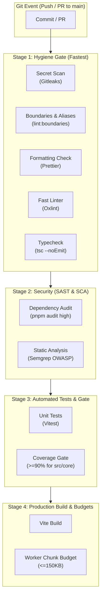

# DevSecOps & CI/CD Pipeline Architecture

The `siem-correlator` repository implements a strict, multi-stage Shift-Left DevSecOps automation pipeline configured via GitHub Actions.

## Fail-Fast Strategy

Pipeline stages execute sequentially. Fast static hygiene checks terminate immediately on failure, preventing unnecessary compute spend on security scans, test runs, or bundle builds.

## Stage Descriptions

1. **Hygiene Gate:**

- **Gitleaks:** Scans git history to prevent credential/token leaks.
- **Architectural Boundaries & Path Aliases (`pnpm run lint:boundaries`):** Strictly enforces 100% path alias usage (`@core/*`, `@features/*`, `@shared/*`, `@workers/*`, `@/*`), prohibits relative imports, and preserves core hexagonal isolation.
- **Prettier:** Validates consistent formatting and Tailwind class sorting.
- **Oxlint:** Evaluates AST rules for security and correctness in milliseconds.
- **TypeScript (`tsc --noEmit`):** Ensures 100% strict type safety before running tests.

2. **Security:**

- **pnpm audit:** Enforces zero known high/critical CVEs across npm packages.
- **Semgrep:** Identifies client-side security risks (prototype pollution, ReDoS patterns).

3. **Automated Tests:**

- **Vitest:** Runs all algorithm tests (`AhoCorasick`, `Deque`, `SlidingWindowRule`).
- Enforces strict coverage threshold of >= 90% for the pure engine under `src/core/`.

4. **Production Build & Budgets:**

- Generates production artifacts using Vite.
- Checks that the Web Worker bundle size stays under 150KB to preserve instant startup times.
