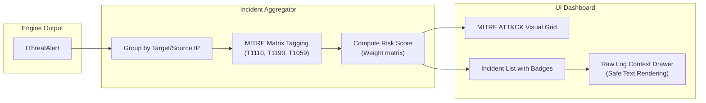

# Feature: Incident Viewer

## Purpose

Presents detected security incidents to the analyst with rich context, severity classification, MITRE ATT&CK mapping, and safe raw log inspection capabilities.

## Responsibilities

- Real-time incident list with auto-scroll
- Severity and category badge rendering
- MITRE ATT&CK technique grid visualization
- Safe raw log context display (no innerHTML)
- Alert filtering and sorting
- Historical alert queries via IndexedDB

## Correlation & MITRE Mapping Pipeline

## MITRE ATT&CK Techniques

| ID    | Name                              | Tactic            | Trigger                             |
| ----- | --------------------------------- | ----------------- | ----------------------------------- |
| T1110 | Brute Force                       | Credential Access | SSH auth failure threshold exceeded |
| T1190 | Exploit Public-Facing Application | Initial Access    | SQLi/traversal patterns in web logs |
| T1595 | Active Scanning                   | Reconnaissance    | Scanner user-agents detected        |
| T1059 | Command and Scripting Interpreter | Execution         | Shell injection patterns            |

## Components

- `IncidentDashboard` — Main layout with incident list and MITRE grid
- `IncidentTable` — Scrollable, sortable alert table
- `MitreAttackGrid` — Visual technique grid with count badges and glow effects
- `IncidentContextDrawer` — Slide-over drawer with full alert details

## Safe Rendering Strategy

All raw log data is rendered using React text interpolation (`{variable}`). Pattern highlighting uses programmatically-constructed `<mark>` elements via `React.createElement`, never `innerHTML`. ANSI sequences and HTML entities are pre-sanitized in the pipeline.
