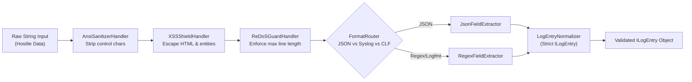

# Feature: Log Ingestion

## Purpose

Handles the intake of raw security log data from multiple sources, sanitizes hostile input, detects log format, extracts structured fields, and produces normalized `ILogEntry` objects for downstream threat detection.

## Responsibilities

- File upload via drag-and-drop (`.log`, `.txt` files)
- Raw log paste via textarea
- Preset dataset loading (SSH Brute Force, Web Attack, Mixed Traffic)
- Line counting and ingestion progress tracking
- Batched dispatch to the detection engine Worker

## Supported Log Formats

- **Syslog RFC 3164/5424**: `<priority>timestamp hostname app[pid]: message`
- **Nginx Access (CLF)**: `ip - - [timestamp] "method path protocol" status size "referer" "user-agent"`
- **Auth Log**: `timestamp hostname sshd[pid]: message`
- **JSON**: `{"timestamp": "...", "message": "...", ...}`

## Sanitization & Parsing Pipeline

## Components

- `LogIngestionPanel` — Main container with tabs for file upload, paste, and presets
- `FileDropZone` — Drag-and-drop area with visual feedback
- `PresetSelector` — Grid of preset dataset cards

## Hooks

- `useFileReader` — FileReader API wrapper for streaming text file reads
