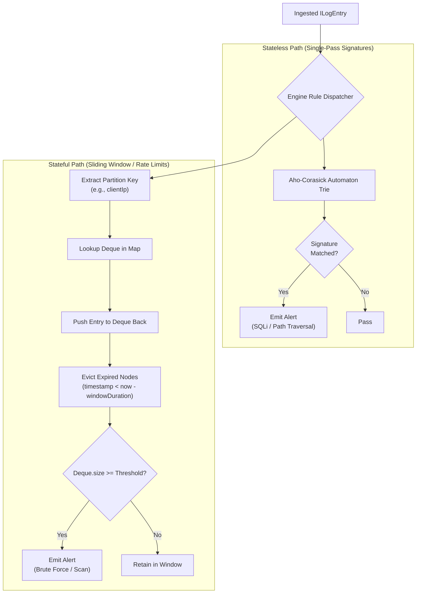

# Feature: Threat Detection

## Purpose

Bridges the React UI layer to the core detection engine running in a Web Worker. Manages Worker lifecycle, typed IPC communication, rule configuration, and alert streaming.

## Responsibilities

- Worker instantiation and lifecycle management
- Typed message dispatch (INGEST_BATCH, CONFIGURE, RESET)
- Alert reception and buffering (EMIT_ALERT)
- Telemetry collection (TELEMETRY_UPDATE)
- Backpressure implementation (batch size limiting)
- Error handling and Worker recovery

## Detection Pipeline

## Rule Types

### Stateless (Signature Rules)

- Backed by Aho-Corasick automaton
- Single-pass evaluation per log entry
- No state between evaluations
- Patterns: SQLi, directory traversal, scanner user-agents, shell injection

### Stateful (Sliding Window Rules)

- Partitioned by key (e.g., source IP)
- Time-windowed frequency tracking
- Deque-backed O(1) event tracking
- Periodic housekeeping for expired entry eviction

## Hooks

- `useDetectionEngine` — Full Worker lifecycle and state management
